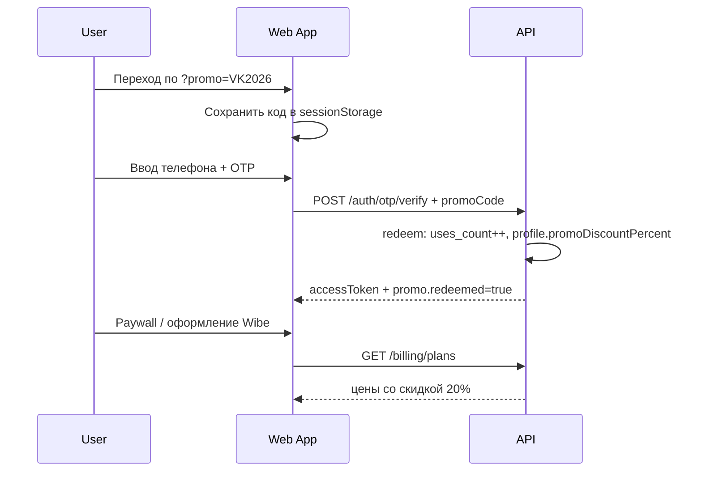

# Гайд: промокоды WibeStyle

Документ для администратора (создание кодов) и для разработчиков (интеграция в web/admin).

## Назначение

Промокод даёт пользователю **скидку в %** на оформление подписки (Wibe / Elite). Код активируется **один раз на пользователя** при успешном входе по OTP. После активации скидка сохраняется в профиле до checkout на paywall.

## Формат промокода

| Правило | Описание |
|---------|----------|
| Символы | Только **латиница A–Z** и **цифры 0–9** |
| Регистр | Автоматически приводится к **CAPS** (`vk20` → `VK20`) |
| Длина | 3–32 символа |
| Кириллица | **Запрещена** — если пользователь ввёл «похожие» кириллические буквы (А, В, С…), API вернёт `PROMO_CYRILLIC_KEYBOARD` с текстом «Переключи клавиатуру на EN» |

Примеры валидных кодов: `VK2026`, `BLOGGER15`, `EARLY100`.

## Создание промокода (админка)

1. Запустите admin: `npm run dev:admin` → http://localhost:3002
2. Откройте **Промокоды** (`/promo`)
3. Введите **Admin API key** (dev: `dev-admin-key`, prod: env `WIBESTYLE_ADMIN_API_KEY`)
4. Заполните форму:
   - **Код** — вручную или кнопка «Сгенерировать»
   - **Скидка %** — 1–90
   - **Лимит регистраций** — сколько пользователей смогут активировать код
   - **Срок действия** — datetime picker
   - **Метка** — например `VK`, `Bloggers`, для вашего учёта
5. Нажмите **Создать промокод**

### Аннулирование

На карточке кода → **Аннулировать**. Отменённый код нельзя активировать (`PROMO_REVOKED`), даже если срок и лимит не исчерпаны.

## API (альтернатива админке)

```http
GET  /api/v1/admin/promo-codes
POST /api/v1/admin/promo-codes
POST /api/v1/admin/promo-codes/generate-code
POST /api/v1/admin/promo-codes/{id}/revoke
Header: X-Admin-Key: <secret>
```

Пример создания:

```json
POST /api/v1/admin/promo-codes
{
  "code": "VK2026",
  "discountPercent": 20,
  "maxUses": 100,
  "expiresAt": "2026-12-31T23:59:59Z",
  "label": "VK early users"
}
```

## Ссылки для VK и других каналов

После создания кода нажмите **Ссылки** на карточке промокода. Будут показаны:

| Тип | URL |
|-----|-----|
| Welcome (рекомендуется) | `https://app.vibestyle.art/welcome?promo=VK2026` |
| Прямо на вход | `https://app.vibestyle.art/auth?promo=VK2026` |

Локально (dev):

```
http://localhost:3001/welcome?promo=VK2026
http://localhost:3001/auth?promo=VK2026
```

### Шаблон поста для VK

```
Примерь одежду с Wildberries и Ozon на себе — до покупки.
3 бесплатные AI-примерки и 1 видео + скидка 20% по промокоду VK2026:
https://app.vibestyle.art/welcome?promo=VK2026
```

Настройте `NEXT_PUBLIC_APP_URL` в admin, чтобы ссылки генерировались с правильным доменом.

## Как это работает для пользователя



1. Пользователь переходит по ссылке с `?promo=CODE` или вводит код на экране входа.
2. После успешного OTP код **гасится** для этого пользователя (повторно тот же код не сработает).
3. Счётчик `uses_count` промокода увеличивается на 1.
4. На paywall цены показываются с учётом `promoDiscountPercent`.

## Ошибки API

| code | Когда |
|------|-------|
| `PROMO_CYRILLIC_KEYBOARD` | В коде есть кириллица |
| `PROMO_INVALID_FORMAT` | Недопустимые символы или длина |
| `PROMO_NOT_FOUND` | Код не существует |
| `PROMO_EXPIRED` | Истёк срок |
| `PROMO_REVOKED` | Админ отменил код |
| `PROMO_EXHAUSTED` | Лимит регистраций исчерпан |
| `PROMO_ALREADY_USED` | Пользователь уже активировал этот код |
| `PROMO_ALREADY_APPLIED` | У пользователя уже есть другая активная скидка |

## Проверка без входа

```http
POST /api/v1/billing/promo/validate
{ "code": "VK2026" }
```

Ответ: `{ "valid": true, "discountPercent": 20, "usesLeft": 99, ... }`

## Env (prod)

```bash
WIBESTYLE_ADMIN_API_KEY=<strong-secret>   # admin promo CRUD
NEXT_PUBLIC_APP_URL=https://app.vibestyle.art  # генерация ссылок в admin
```

## Связанные файлы

- Backend: `PromoService`, `AdminPromoController`, `V6__billing_promo.sql`
- Admin UI: `apps/admin/app/promo/page.tsx`
- Web: `OtpForm.tsx`, `lib/promo-storage.ts`, `packages/shared-types/src/promo-code.ts`

